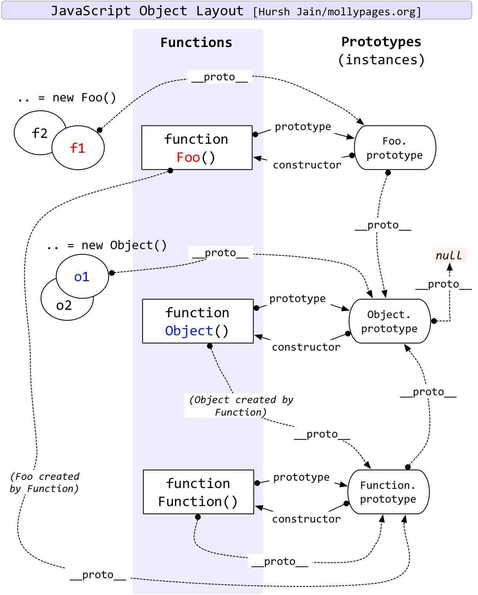

# javascript 学习记录

[1. 数据类型判断](#数据类型判断)

[2. 执行上下文和执行栈](#执行上下文和执行栈)

[3. 闭包](#闭包)

[4. 防抖、节流、柯理化](#防抖、节流、柯理化)

[5. 原型和原型链](#原型和原型链)

[6. 继承](#继承)

## 数据类型判断

- typeof 判断基本数据类型。

- Object.prototype.toString() 返回“[object Class]”类型的字符串结果

## 执行上下文和执行栈

> js 代码是一段一段执行的，那么这“一段”是如何划分的呢？当 javascript 引擎遇到可执行代码时，如：全局代码、函数、eval 代码。就会做“准备工作”，即执行上下文。javascript 利用执行栈管理执行上下文，每遇到一个可执行的上下文，就往执行栈里 push 一个上下文对象，每当执行完相关代码，如一个函数，就销毁执行上下文，将其从执行栈中弹出。由 javascript 执行顺序可知，最先被 push 到栈里的是全局代码。

执行上下文对象有三个重要的属性如下：

- 变量对象： 全局对象 GO、活动对象 AO
- 作用域链：每个变量对象都有自己的上下文，作用域链正是这些上下文组成的链表，当一个变量在函数内部的上下文没有时，它就是一个自由变量，查找自由变量，就会形成作用域链，一直向上查找，直到找到，找不到则为 undefined。可以类比于原型链理解。
- this 指向：

  全局调用时，在非严格模式下，this 指向全局对象，严格模式下等于 undefined。若作为某个对象的方法调用，则 this 指向这个对象。即 this 指向调用方法的引用类型。

  this 与上下文中可执行代码的类型有直接关系，this 值在进入上下文时确定，并且在上下文运行期间永久不变。

  改变 this 指向三个方法： `call`,`apply`, `bind`

> > 参考：

> > [JavaScript 深入之 call 和 apply 的模拟实现 ](https://github.com/mqyqingfeng/blog/issues/11)

> > [JavaScript 深入之 bind 的模拟实现 ](https://github.com/mqyqingfeng/Blog/issues/12)

> > [bind ---MDN](https://developer.mozilla.org/zh-CN/docs/Web/JavaScript/Reference/Global_Objects/Function/bind)

## 闭包

## 防抖、节流、柯理化

- 防抖

  > 防抖原理： 如果持续触发事件，在事件停止触发 n 秒后才执行，如果在 n 秒内触发了多次，以最后一次触发为准
  >
  > 防抖应用：

  > - window 的 resize、scroll
  > - 输入框搜索

  ```javascript
  // 1. 实现一个基本的
  // 2. 考虑this指向
  // 3. 考虑传参
  // 4. 立即执行,可以加一个immediate
  // 5.取消防抖
  function debouce(func, wait, immediate) {
    let timer = null;
    return function () {
      const context = this;
      const args = [...arguments];
      if (timer) {
        clearTimeout(timer);
      }
      if (immediate) {
        // 没有定时器，首次执行
        if (!timer) {
          func.apply(context, args);
        }
        clearTimeout(timer);
        // 设置定时器,延迟执行
        timer = setTimeout(function () {
          func.apply(context, args);
          timer = null;
        }, wait);
      } else {
        timer = setTimeout(function () {
          func.apply(context, args);
        }, wait);
      }
    };
    debouce.cancel = function () {
      clearTimeout(timer);
      timer = null;
    };
  }
  ```

- 节流

  > 如果你持续触发事件，每隔 n 秒，只执行一次事件。

  1. 使用时间戳： 第一次会立即执行，停止事件触发后不会再执行事件。

  ```javascript
  function throttle(fn, wait) {
    let previous = 0;
    return function () {
      const context = this;
      let now = new Date();
      if (now - previous > wait) {
        // 当前时间大于约定时间
        fn.apply(context, arguments);
        previous = now;
      }
    };
  }
  ```

  2. 使用定时器：第一次不会立即执行，停止事件触发后的一段时间会再执行一次。

  ```javascript
  function throttle(fn, wait) {
    let timer, context, args;
    return function () {
      context = this;
      args = arguments;
      if (!timer) {
        // 如果定时器存在，则不执行,不存在，则执行定时器，执行函数，
        timer = setTimeout(function () {
          timer = null;
          fn.apply(context, args);
        }, wait);
      }
    };
  }
  ```

- 柯里化

  > 柯里化是一种将使用多个参数的一个函数转换成一系列使用一个参数的函数的技术
  > 用闭包把参数保存起来，当参数的数量足够执行函数了，就开始执行函数

  ```javascript
  function curry(func) {
    // 取参数
    let args = [].slice.call(arguments, 1);
    return function () {
      let curArguments = [].slice.call(arguments, 0);
      let totalArguments = args.concat(curArguments);
      if (totalArguments.length >= func.length) {
        return func.apply(this, totalArguments);
      } else {
        totalArguments.unshift(func);
        return curry.apply(this, totalArguments);
      }
    };
  }

  let add = curry(sum, 1);

  console.log(add(2, 3));
  console.log(add(2)(3));
  ```

## 原型和原型链


原型和原型链的运用：

- new 操作符的实现

```javascript
function newF() {
  // 1. 创建一个空对象，对象要继承构造函数里的属性，还要继承构造函数原型上的属性
  let obj = {};
  // 2. 继承构造函数原型上的属性
  const constructor = [].shift.call(arguments);
  obj.__proto__ = constructor.prototype;
  //3. 执行构造函数，继承构造函数属性,构造函数有返回值时：如果有返回值，则需要判断返回值是是否是对象，是对象则返回该对象，非对象则返回创建的obj
  const result = constructor.apply(obj, arguments);
  // 4. 返回对象
  return typeof result === "object" ? result : obj;
}

function Person(name) {
  this.name = name;
}
Person.prototype.age = 18;
Person.prototype.sayName = function () {
  console.log("name" + this.name);
};

// let person = new Person('jack');
let person = newF(Person, "jack");
console.log(person.name);
console.log(person.age);
person.sayName();
```

- instanceof 实现

  instanceof:用来判断某个构造函数的原型是否在某个实例对象的原型链上

```javascript
function instanceOF(left, right) {
  let le = left.__proto__;
  let ri = right.prototype;
  while (le) {
    if (le === ri) {
      return true;
    }
    le = le.__proto__;
  }
  return false;
}

function Car() {
  //
}
let car = new Car();
console.log(instanceOF(car, Object));
console.log(instanceOF(car, Car));
```

## 继承

- 原型链继承
  - 引用类型的属性会被所有实例共享
  - 无法向父类传参
- 构造函数继承
  - 每次创建实例都会创建一遍方法
- 组合继承：原型链+构造函数
  - 会两次调用父类构造函数
- 原型式继承
  ```javascript
  function inherit(obj) {
    function F() {}
    F.prototype = obj;
    return new F();
  }
  ```
- 寄生式继承
  - 在内部以某种方法增强对象
- 寄生组合式继承
  ```javascript
  function inherit(target, origin) {
    function F() {}
    F.prototype = origin.prototype;
    let f = new F();
    f.constructor = target;
    target.prototype = f;
  }
  ```

---

## var/let/const

- 本质区别？

参考：
[ES6 系列之 let 和 const ](https://github.com/mqyqingfeng/Blog/issues/82)

## 箭头函数

- 与普通函数的区别？
  - this 指向最近一层非箭头函数的 this
  - 没有 arguments
  - 没有构造函数，所以不能使用 new

参考：
[ES6 系列之箭头函数](https://github.com/mqyqingfeng/Blog/issues/85)

## set&map

### set

#### 基本用法

- 一种新的数据结构，每一个值都是唯一的
- Set 函数可以接受一个数组（或者具有 iterable 接口的其他数据结构）作为参数，用来初始化
- set 在使用 add 时，去除重复值用的是`===`， 但是对于 NaN,在 add 时只能保存一个

#### 实例属性和方法

- 有 API： `add`, `delete`, `clear`,`has`,`size`

#### 遍历操作

-` keys()`、`values()`、`entries()`、 `forEach()`
